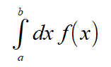
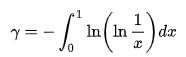
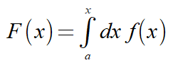
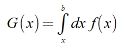
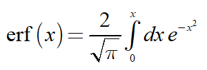
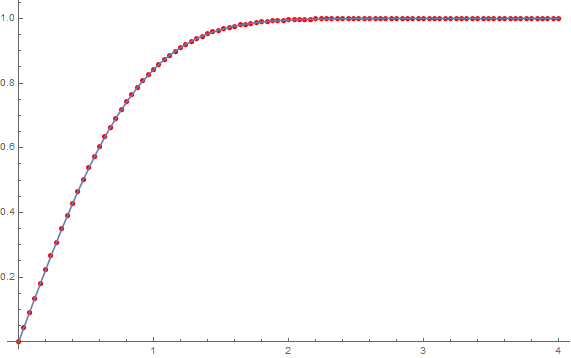
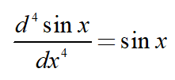
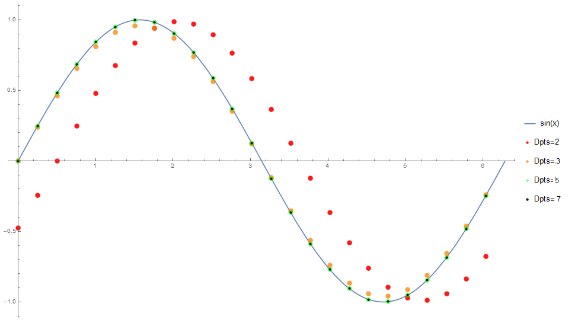

[Table of Contents](README.md)


# Calculus in Mathématiques
_This document was automatically generated from file_ **`calculus.cpp`** (Mathématiques-v3.2-r1).

## Integration
### Definite integrals
Integrating over an interval (a,b) yields a single number--the area under the curve.




**EXAMPLE 1**: Definite integrals
```C++
const size_type N = 100000;
const double a = 0;
const double b = 1;
Vector<double> x(linspace_ab<double>(a,b,N));
Vector<double> f;
f=-log(log(1/x));
```

Integrating f(x), as given above, yields the [Euler–Mascheroni](http://mathworld.wolfram.com/Euler-MascheroniConstant.html) constant whose exact value is `0.577215664901532...`.  The function _f_(_x_) is singular at both x=0 and x=1.  Thus we omitted these points. As the results show, many points are needed to achieve even a few digits of accuracy, due to the singularities. 

 

**Results**
```C++
  N = 100000; 
  a = 0; 
  b = 1; 
  integrate_a2b(f,a,b,0) = 0.577168; 
  integrate_a2b(f,a,b,1) = 0.577128; 
  integrate_a2b: Number of points must be odd N=100000
integrate_a2b(f,a,b,2) = 0.57709; 
```

### Semi-Definite Integrals
A semi-definite integral is created by replacing one of the end points with _x_.

* For the integral



use the method `f.integrate_a2x(a, b)` or the function `integrate_a2x(f, a, b)`.


* For the integral



use the method `f.integrate_x2b(a, b)` or the function `integrate_x2b(f, a, b)`.


Where [`a`,`b`] defines the interval being used


A semi-definite integral yields a function as its output.
Integration requires a cumulative sum.  Thus the caculation can not be accomplished via element-wise operations.  For this reasons these functions can be performed: 
  * on a Vector in place using `f.integrate_a2x(a, b)`, mimizing both memory usage and computation time.
  * on a Vector or expression using the function `integrate_a2x(f, a, b)`,  in which case a `new Vector` is created inside the function and returned. 
All of the remaining functions discussed in this page can be called in either manner.


**EXAMPLE 2**:  The error function integral
The [error function](http://mathworld.wolfram.com/Erf.html) is the following semi-definite integral of a Gaussian function (with zero mean and variance of 1/2).


```C++
const size_type N = 101;
const double a = 0;
const double b = 4;
const double pi = 3.14159265358979323846;
Vector<double> x( linspace<double>(a,b,N) );
Vector<double> gauss;
gauss = 2/sqrt(pi)*exp(-sqr(x));
Vector<double> erf = gauss;
erf.integrate_a2x(a,b);
set_mathematica_var_format();
```

The results _x_ and _erf_(_x_) are:

```Mathematica
x = {
     0.00000000 10^+00,  4.00000000 10^-02,  8.00000000 10^-02,  1.20000000 10^-01,  1.60000000 10^-01, 
     2.00000000 10^-01,  2.40000000 10^-01,  2.80000000 10^-01,  3.20000000 10^-01,  3.60000000 10^-01, 
     4.00000000 10^-01,  4.40000000 10^-01,  4.80000000 10^-01,  5.20000000 10^-01,  5.60000000 10^-01, 
     6.00000000 10^-01,  6.40000000 10^-01,  6.80000000 10^-01,  7.20000000 10^-01,  7.60000000 10^-01, 
     8.00000000 10^-01,  8.40000000 10^-01,  8.80000000 10^-01,  9.20000000 10^-01,  9.60000000 10^-01, 
     1.00000000 10^+00,  1.04000000 10^+00,  1.08000000 10^+00,  1.12000000 10^+00,  1.16000000 10^+00, 
     1.20000000 10^+00,  1.24000000 10^+00,  1.28000000 10^+00,  1.32000000 10^+00,  1.36000000 10^+00, 
     1.40000000 10^+00,  1.44000000 10^+00,  1.48000000 10^+00,  1.52000000 10^+00,  1.56000000 10^+00, 
     1.60000000 10^+00,  1.64000000 10^+00,  1.68000000 10^+00,  1.72000000 10^+00,  1.76000000 10^+00, 
     1.80000000 10^+00,  1.84000000 10^+00,  1.88000000 10^+00,  1.92000000 10^+00,  1.96000000 10^+00, 
     2.00000000 10^+00,  2.04000000 10^+00,  2.08000000 10^+00,  2.12000000 10^+00,  2.16000000 10^+00, 
     2.20000000 10^+00,  2.24000000 10^+00,  2.28000000 10^+00,  2.32000000 10^+00,  2.36000000 10^+00, 
     2.40000000 10^+00,  2.44000000 10^+00,  2.48000000 10^+00,  2.52000000 10^+00,  2.56000000 10^+00, 
     2.60000000 10^+00,  2.64000000 10^+00,  2.68000000 10^+00,  2.72000000 10^+00,  2.76000000 10^+00, 
     2.80000000 10^+00,  2.84000000 10^+00,  2.88000000 10^+00,  2.92000000 10^+00,  2.96000000 10^+00, 
     3.00000000 10^+00,  3.04000000 10^+00,  3.08000000 10^+00,  3.12000000 10^+00,  3.16000000 10^+00, 
     3.20000000 10^+00,  3.24000000 10^+00,  3.28000000 10^+00,  3.32000000 10^+00,  3.36000000 10^+00, 
     3.40000000 10^+00,  3.44000000 10^+00,  3.48000000 10^+00,  3.52000000 10^+00,  3.56000000 10^+00, 
     3.60000000 10^+00,  3.64000000 10^+00,  3.68000000 10^+00,  3.72000000 10^+00,  3.76000000 10^+00, 
     3.80000000 10^+00,  3.84000000 10^+00,  3.88000000 10^+00,  3.92000000 10^+00,  3.96000000 10^+00, 
     4.00000000 10^+00
}; 
erf = {
     0.00000000 10^+00,  4.50990874 10^-02,  9.00542035 10^-02,  1.34722754 10^-01,  1.78964878 10^-01, 
     2.22644760 10^-01,  2.65631874 10^-01,  3.07802157 10^-01,  3.49039065 10^-01,  3.89234530 10^-01, 
     4.28289776 10^-01,  4.66116007 10^-01,  5.02634945 10^-01,  5.37779218 10^-01,  5.71492603 10^-01, 
     6.03730117 10^-01,  6.34457960 10^-01,  6.63653329 10^-01,  6.91304101 10^-01,  7.17408392 10^-01, 
     7.41974023 10^-01,  7.65017886 10^-01,  7.86565245 10^-01,  8.06648966 10^-01,  8.25308708 10^-01, 
     8.42590092 10^-01,  8.58543840 10^-01,  8.73224930 10^-01,  8.86691757 10^-01,  8.99005316 10^-01, 
     9.10228427 10^-01,  9.20425003 10^-01,  9.29659362 10^-01,  9.37995609 10^-01,  9.45497068 10^-01, 
     9.52225784 10^-01,  9.58242093 10^-01,  9.63604249 10^-01,  9.68368120 10^-01,  9.72586950 10^-01, 
     9.76311170 10^-01,  9.79588273 10^-01,  9.82462732 10^-01,  9.84975970 10^-01,  9.87166365 10^-01, 
     9.89069294 10^-01,  9.90717206 10^-01,  9.92139722 10^-01,  9.93363749 10^-01,  9.94413623 10^-01, 
     9.95311246 10^-01,  9.96076247 10^-01,  9.96726140 10^-01,  9.97276483 10^-01,  9.97741036 10^-01, 
     9.98131921 10^-01,  9.98459771 10^-01,  9.98733872 10^-01,  9.98962305 10^-01,  9.99152071 10^-01, 
     9.99309212 10^-01,  9.99438921 10^-01,  9.99545645 10^-01,  9.99633178 10^-01,  9.99704740 10^-01, 
     9.99763059 10^-01,  9.99810434 10^-01,  9.99848796 10^-01,  9.99879761 10^-01,  9.99904674 10^-01, 
     9.99924655 10^-01,  9.99940629 10^-01,  9.99953359 10^-01,  9.99963471 10^-01,  9.99971478 10^-01, 
     9.99977798 10^-01,  9.99982771 10^-01,  9.99986670 10^-01,  9.99989719 10^-01,  9.99992095 10^-01, 
     9.99993940 10^-01,  9.99995369 10^-01,  9.99996472 10^-01,  9.99997320 10^-01,  9.99997971 10^-01, 
     9.99998468 10^-01,  9.99998847 10^-01,  9.99999135 10^-01,  9.99999353 10^-01,  9.99999518 10^-01, 
     9.99999642 10^-01,  9.99999734 10^-01,  9.99999804 10^-01,  9.99999856 10^-01,  9.99999894 10^-01, 
     9.99999922 10^-01,  9.99999943 10^-01,  9.99999959 10^-01,  9.99999970 10^-01,  9.99999978 10^-01, 
     9.99999984 10^-01
}; 
```
Cut and paste the above data for `x` and `erf` into Mathematica as well as the following commands

```Mathematica
p1=ListPlot[Partition[Riffle[x,erf],2],PlotStyle->Red];
p2=Plot[Erf[0,x],{x,0,4}];
Show[p1,p2]
```
This yields the following plot comparing the results above [red dots] to the exact function [solid blue].

### Semi-Definite Integrals: optional parameters
The optional `order` parameter specifies the integration method order: 

* 0 for rectangular integration

* 1 for trapezoidal integration (DEFAULT).

Usage: 

* `f.integrate_x2b(a, b, order)`
* `integrate_x2b(f, a, b, order)`
## Differentiation
* Differentiation requires points around it.   The derivative can be performed :
  * on a Vector in place using `f.deriv(a, b)`, mimizing both memory usage and computation time.
  * on a Vector or expression using the function `deriv(f, a, b)`,  in which case a `new Vector` is created inside the function and returned. 


**EXAMPLE 3**: Derivative of the function _f_(_x_) = 5 _x_


The derivative of the function _f_(_x_) = is the constant 5
```C++
set_default_format();
const double pi = 3.14159265358979323846;
const size_type N = 11;
const double a = 0;
const double b = 1;
Vector<double> x( linspace<double>(a,b,N) );
```

**Results**
```C++
  x = {0,0.1,0.2,0.3,0.4,0.5,0.6,0.7,0.8,0.9,1}; 
  deriv(5*x,a,b) = {5,5,5,5,5,5,5,5,5,5,5}; 
```

### Differentiation: optional parameters
* The differentiation method/function has 3 optional parameters:
  * `f.deriv(a, b, n, Dpts, periodic)` or `deriv(f, a, b, n, Dpts, periodic)`
* The optional parameters are:
  * `n` [DEFAULT=`1`] is the number of derivatives to compute: 
  * `Dpts` [DEFAULT=`7`] is the number of points to use in the calculation: 2,3,5, or 7.  More points yield better accuracy. 
  * `periodic` [DEFAULT=`false`]. When set to `true` the derivative at the end points will be of higher accuracy for periodic function.
### Differentiation: taking multiple derivatives in one call


**EXAMPLE 4**: The fourth derivative of sin _x_


Here we take the 4th derivative of sin _x_ using `Dpts`=2,3,5, and 7 points. The result for all should be sin _x_:





We also set `periodic=true` since sin _x_ is periodic over [0,2pi)
```C++
set_mathematica_var_format();
const double pi = 3.14159265358979323846;
const size_type N = 25;
Vector<double> x( linspace_b<double>(0,2*pi,N) );
const double a = min(x);
const double b = max(x);
Vector<double> f = sin(x);
Vector<double> f2 = deriv(f,a,b,4,2,true );
Vector<double> f3 = deriv(f,a,b,4,3,true );
Vector<double> f5 = deriv(f,a,b,4,5,true );
Vector<double> f7 = deriv(f,a,b,4,7,true );
```

```Mathematica
x = {
     0.00000000 10^+00,  2.51327412 10^-01,  5.02654825 10^-01,  7.53982237 10^-01,  1.00530965 10^+00, 
     1.25663706 10^+00,  1.50796447 10^+00,  1.75929189 10^+00,  2.01061930 10^+00,  2.26194671 10^+00, 
     2.51327412 10^+00,  2.76460154 10^+00,  3.01592895 10^+00,  3.26725636 10^+00,  3.51858377 10^+00, 
     3.76991118 10^+00,  4.02123860 10^+00,  4.27256601 10^+00,  4.52389342 10^+00,  4.77522083 10^+00, 
     5.02654825 10^+00,  5.27787566 10^+00,  5.52920307 10^+00,  5.78053048 10^+00,  6.03185789 10^+00
}; 
f2 = {
    -4.76705933 10^-01, -2.46084153 10^-01,  3.91384923 10^-13,  2.46084153 10^-01,  4.76705933 10^-01, 
     6.77374527 10^-01,  8.35481188 10^-01,  9.41091493 10^-01,  9.87569558 10^-01,  9.71994996 10^-01, 
     8.95346414 10^-01,  7.62439924 10^-01,  5.81626529 10^-01,  3.64267400 10^-01,  1.24020011 10^-01, 
    -1.24020011 10^-01, -3.64267400 10^-01, -5.81626529 10^-01, -7.62439924 10^-01, -8.95346414 10^-01, 
    -9.71994996 10^-01, -9.87569558 10^-01, -9.41091493 10^-01, -8.35481188 10^-01, -6.77374527 10^-01
}; 
f3 = {
     4.72665765 10^-14,  2.38413689 10^-01,  4.61846969 10^-01,  6.56260706 10^-01,  8.09439168 10^-01, 
     9.11757591 10^-01,  9.56786932 10^-01,  9.41697830 10^-01,  8.67438391 10^-01,  7.38674607 10^-01, 
     5.63497181 10^-01,  3.52913155 10^-01,  1.20154297 10^-01, -1.20154297 10^-01, -3.52913155 10^-01, 
    -5.63497181 10^-01, -7.38674607 10^-01, -8.67438391 10^-01, -9.41697830 10^-01, -9.56786932 10^-01, 
    -9.11757591 10^-01, -8.09439168 10^-01, -6.56260706 10^-01, -4.61846969 10^-01, -2.38413689 10^-01
}; 
f5 = {
     1.18056005 10^-13,  2.48558605 10^-01,  4.81499360 10^-01,  6.84185738 10^-01,  8.43882210 10^-01, 
     9.50554460 10^-01,  9.97499877 10^-01,  9.81768708 10^-01,  9.04349400 10^-01,  7.70106494 10^-01, 
     5.87474964 10^-01,  3.67930222 10^-01,  1.25267071 10^-01, -1.25267071 10^-01, -3.67930222 10^-01, 
    -5.87474964 10^-01, -7.70106494 10^-01, -9.04349400 10^-01, -9.81768708 10^-01, -9.97499877 10^-01, 
    -9.50554460 10^-01, -8.43882210 10^-01, -6.84185738 10^-01, -4.81499360 10^-01, -2.48558605 10^-01
}; 
f7 = {
     1.85797403 10^-13,  2.48688118 10^-01,  4.81750248 10^-01,  6.84542237 10^-01,  8.44321920 10^-01, 
     9.51049752 10^-01,  9.98019630 10^-01,  9.82280264 10^-01,  9.04820617 10^-01,  7.70507762 10^-01, 
     5.87781072 10^-01,  3.68121934 10^-01,  1.25332342 10^-01, -1.25332342 10^-01, -3.68121934 10^-01, 
    -5.87781072 10^-01, -7.70507762 10^-01, -9.04820617 10^-01, -9.82280264 10^-01, -9.98019630 10^-01, 
    -9.51049752 10^-01, -8.44321920 10^-01, -6.84542237 10^-01, -4.81750248 10^-01, -2.48688118 10^-01
}; 
```
Cut and paste the above data for `x`, `f2`, `f3`,...  into Mathematica as well as the following commands

```Mathematica
p2 = ListPlot[Partition[Riffle[x, f2], 2], PlotStyle -> {Red, PointSize[0.01], Opacity[0.9]},PlotLegends -> {"Dpts=2"}];
p3 = ListPlot[Partition[Riffle[x, f3], 2], PlotStyle -> {Orange, PointSize[0.01], Opacity[0.75]}, PlotLegends -> {"Dpts=3"}];
p5 = ListPlot[Partition[Riffle[x, f5], 2], PlotStyle -> {Green, PointSize[0.01], Opacity[0.5]}, PlotLegends -> {"Dpts=5"}];
p7 = ListPlot[Partition[Riffle[x, f7], 2],PlotStyle -> {Black, PointSize[0.005], Opacity[0.9]}, PlotLegends -> {"Dpts=7"}];
p = Plot[Sin[x], {x, 0, 2*Pi}, PlotLegends -> {"sin(x)"}];
Show[p, p2, p3, p5, p7]
```
This yields the following plot comparing the results above [dots] to the exact function [solid blue].

From these results we observe:
* the 2 point derivative has a bias that shifts the data to the right by 1/2 a grid point for each derivative taken.
* the 3 point derivative is approximately correct: rms error = 2.9%
* the 5 point derivative is very accurate:         rms error = 0.04%
* the 7 point derivative is even more accurate:    rms error = 5ppm


The root mean square (rms) errors were calculated in Mathematica using the following commands.
```Mathematica
RootMeanSquare[f2 - Sin[x]]*100
RootMeanSquare[f3 - Sin[x]]*100
RootMeanSquare[f5 - Sin[x]]*100
RootMeanSquare[f7 - Sin[x]]*10^6
```
## Various functions related to integration and differentiation
All of these functions can be called _either_ as a method, eg `v.cumsum()` or a function `cumsum(v)`.


**EXAMPLE 5**: Various functions: `cumsum`, `cumprod`, `cumtrapz`, `diff`, etc
```C++
set_default_format();
Vector<double> v1(5);
```

**Some expressions with results**
```C++
  v1 = {1,4,9,16,25} = {1,4,9,16,25}; 
  v1.cumsum() = {1,5,14,30,55}; 
  v1 = {1,4,9,16,25} = {1,4,9,16,25}; 
  v1.cumtrapz() = {0,2.5,9,21.5,42}; 
  v1 = {1,2,3,4,5} = {1,2,3,4,5}; 
  v1.cumprod() = {1,2,6,24,120}; 
  v1 = {1,4,9,16,25} = {1,4,9,16,25}; 
  v1.diff() = {3,3,5,7,9}; 
  v1 = {1,4,9,16,25} = {1,4,9,16,25}; 
  v1.diff(true) = {-24,3,5,7,9}; 
  v1 = {25,16,9,4,1} = {25,16,9,4,1}; 
  v1.cumsum_rev() = {55,30,14,5,1}; 
  v1 = {25,16,9,4,1} = {25,16,9,4,1}; 
  v1.cumtrapz_rev() = {42,21.5,9,2.5,0}; 
  v1 = {5,4,3,2,1} = {5,4,3,2,1}; 
  v1.cumprod_rev() = {120,24,6,2,1}; 
  v1 = {1,4,9,16,25} = {1,4,9,16,25}; 
  v1.diff_rev() = {3,5,7,9,9}; 
  v1 = {1,4,9,16,25} = {1,4,9,16,25}; 
  v1.diff_rev(true) = {3,5,7,9,-24}; 
```

The suffix `_rev` denote that the function starts at the highest element instead of the lowest element. Passing `true` to diff signifies that the function is periodic over the interval [a,b]. 

[Table of Contents](README.md)
