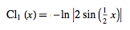
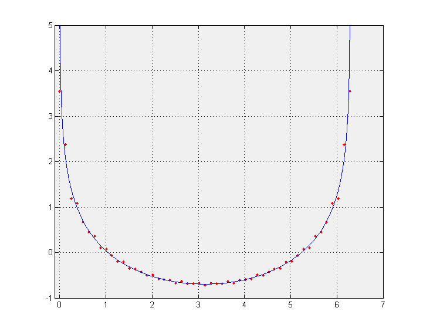
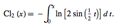
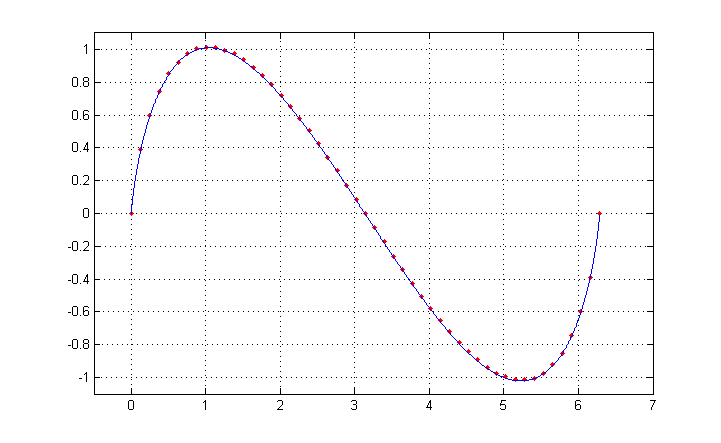

[Table of Contents](README.md)


# Calculating a function via Fourier series and plotting the results in Matlab
_This document was automatically generated from file_ **`fourier.cpp`** (Mathématiques-v3.2-r1).

## Fourier Series for the Clausen Functions
As our example, we'll use the [Clausen functions](http://mathworld.wolfram.com/ClausenFunction.html). The Clausen function of order _n_ has Fourier series: 

### Clausen function of order _n=1_


Set up the output format so that we can copy and paste into Matlab
```C++
using namespace display;
FormatDataVector::string_opening = "[ ...\n    ";
FormatDataVector::string_delimeter = ", ";
FormatDataVector::max_elements_per_line = 5;
FormatDataVector::string_endofline = " ...\n    ";
FormatDataVector::string_closing = " ...\n]";
setFormatString<double>("% 10.8e");
FormatData<double>::tens = false;
```

Define the coefficient vectors: 

```C++
const size_type N = 20;
Vector<double> k = range<double>(0,N-1);
Vector<double> An = 1/k;
An[0] = 0.;
Vector<double> Bn = Vector<double>(N,0.);
```

Define the coordinate vector `t` as 51 points over the interval [0,+2pi]: 

```C++
const double pi = 3.14159265358979323846;
Vector<double> t = linspace<double>(0,2*pi,51);
```

Calculate the Fourier series and store the results in vector `CL1`: 

```C++
const double T = 2*pi;
const double omega = 2*pi/T;
Vector<double> CL1 = ifourier(An,Bn, t, An.size(), omega );
```

The results `t` and `CL1` are:

```Matlab
t = [ ...
     0.00000000e+00,  1.25663706e-01,  2.51327412e-01,  3.76991118e-01,  5.02654825e-01,  ...
     6.28318531e-01,  7.53982237e-01,  8.79645943e-01,  1.00530965e+00,  1.13097336e+00,  ...
     1.25663706e+00,  1.38230077e+00,  1.50796447e+00,  1.63362818e+00,  1.75929189e+00,  ...
     1.88495559e+00,  2.01061930e+00,  2.13628300e+00,  2.26194671e+00,  2.38761042e+00,  ...
     2.51327412e+00,  2.63893783e+00,  2.76460154e+00,  2.89026524e+00,  3.01592895e+00,  ...
     3.14159265e+00,  3.26725636e+00,  3.39292007e+00,  3.51858377e+00,  3.64424748e+00,  ...
     3.76991118e+00,  3.89557489e+00,  4.02123860e+00,  4.14690230e+00,  4.27256601e+00,  ...
     4.39822972e+00,  4.52389342e+00,  4.64955713e+00,  4.77522083e+00,  4.90088454e+00,  ...
     5.02654825e+00,  5.15221195e+00,  5.27787566e+00,  5.40353936e+00,  5.52920307e+00,  ...
     5.65486678e+00,  5.78053048e+00,  5.90619419e+00,  6.03185789e+00,  6.15752160e+00,  ...
     6.28318531e+00 ...
]; 
CL1 = [ ...
     3.54773966e+00,  2.37649806e+00,  1.18837837e+00,  1.08954466e+00,  6.70212104e-01,  ...
     4.49882732e-01,  3.66844724e-01,  1.01722992e-01,  7.16511105e-02, -7.02907275e-02,  ...
    -1.88547918e-01, -2.03656272e-01, -3.47537369e-01, -3.62834235e-01, -4.23505952e-01,  ...
    -5.07163697e-01, -4.93690818e-01, -5.82134430e-01, -5.89925205e-01, -6.05336519e-01,  ...
    -6.68655244e-01, -6.36694714e-01, -6.87730744e-01, -6.90152151e-01, -6.71362890e-01,  ...
    -7.18771403e-01, -6.71362890e-01, -6.90152151e-01, -6.87730744e-01, -6.36694714e-01,  ...
    -6.68655244e-01, -6.05336519e-01, -5.89925205e-01, -5.82134430e-01, -4.93690818e-01,  ...
    -5.07163697e-01, -4.23505952e-01, -3.62834235e-01, -3.47537369e-01, -2.03656272e-01,  ...
    -1.88547918e-01, -7.02907275e-02,  7.16511105e-02,  1.01722992e-01,  3.66844724e-01,  ...
     4.49882732e-01,  6.70212104e-01,  1.08954466e+00,  1.18837837e+00,  2.37649806e+00,  ...
     3.54773966e+00 ...
]; 
```
Cut and paste the above data for `t` and `CL1` into Matlab as well as the following commands

```Matlab
N=10000;
dt=2*pi/N;
tt=linspace(dt,2*pi-dt,10000);
y1=-log(2*abs(sin(tt/2)));
plot(t,CL1,'r.',tt,y1)
```
The above matlab code calculates the first Clausen function using the equation





We exclude the end points, 0 and pi, because the function is infinite at these points.
This yields the following plot comparing the Fourier series [red dots] to the exact function [solid blue].

### Clausen function of order _n=2_


Set up the output format so that we can copy and paste into Matlab, this time using the function `set_matlab_var_format()`
```C++
set_matlab_var_format();
```

Define the coefficient vectors: 

```C++
const size_type N = 20;
Vector<double> k = range<double>(0,N-1);
Vector<double> An = Vector<double>(N,0.);
Vector<double> Bn = 1./sqr(k);
Bn[0] = 0.;
```

Define the coordinate vector `t` as 51 points over the interval [0,+2pi]: 

```C++
const double pi = 3.14159265358979323846;
Vector<double> t = linspace<double>(0,2*pi,51);
```

Calculate the Fourier series and store the results in vector `CL2`: 

```C++
const double T = 2*pi;
const double omega = 2*pi/T;
Vector<double> CL2 = ifourier(An,Bn, t, An.size(), omega );
```

The results `t` and `CL2` are:

```Matlab
t = [ ...
     0.00000000e+00,  1.25663706e-01,  2.51327412e-01,  3.76991118e-01,  5.02654825e-01,  ...
     6.28318531e-01,  7.53982237e-01,  8.79645943e-01,  1.00530965e+00,  1.13097336e+00,  ...
     1.25663706e+00,  1.38230077e+00,  1.50796447e+00,  1.63362818e+00,  1.75929189e+00,  ...
     1.88495559e+00,  2.01061930e+00,  2.13628300e+00,  2.26194671e+00,  2.38761042e+00,  ...
     2.51327412e+00,  2.63893783e+00,  2.76460154e+00,  2.89026524e+00,  3.01592895e+00,  ...
     3.14159265e+00,  3.26725636e+00,  3.39292007e+00,  3.51858377e+00,  3.64424748e+00,  ...
     3.76991118e+00,  3.89557489e+00,  4.02123860e+00,  4.14690230e+00,  4.27256601e+00,  ...
     4.39822972e+00,  4.52389342e+00,  4.64955713e+00,  4.77522083e+00,  4.90088454e+00,  ...
     5.02654825e+00,  5.15221195e+00,  5.27787566e+00,  5.40353936e+00,  5.52920307e+00,  ...
     5.65486678e+00,  5.78053048e+00,  5.90619419e+00,  6.03185789e+00,  6.15752160e+00,  ...
     6.28318531e+00 ...
]; 
CL2 = [ ...
     0.00000000e+00,  3.91566598e-01,  6.00043244e-01,  7.41013319e-01,  8.55181325e-01,  ...
     9.20043638e-01,  9.74362042e-01,  1.00263931e+00,  1.01203918e+00,  1.01443074e+00,  ...
     9.95652326e-01,  9.72211411e-01,  9.37639689e-01,  8.91563220e-01,  8.43916566e-01,  ...
     7.83912730e-01,  7.21452670e-01,  6.54423794e-01,  5.79351826e-01,  5.05675854e-01,  ...
     4.24673341e-01,  3.42573051e-01,  2.60246747e-01,  1.72246706e-01,  8.78556347e-02,  ...
    -2.15360760e-16, -8.78556347e-02, -1.72246706e-01, -2.60246747e-01, -3.42573051e-01,  ...
    -4.24673341e-01, -5.05675854e-01, -5.79351826e-01, -6.54423794e-01, -7.21452670e-01,  ...
    -7.83912730e-01, -8.43916566e-01, -8.91563220e-01, -9.37639689e-01, -9.72211411e-01,  ...
    -9.95652326e-01, -1.01443074e+00, -1.01203918e+00, -1.00263931e+00, -9.74362042e-01,  ...
    -9.20043638e-01, -8.55181325e-01, -7.41013319e-01, -6.00043244e-01, -3.91566598e-01,  ...
    -9.12300242e-16 ...
]; 
```
Cut and paste the above data for t and CL2 into Matlab as well as the following commands.

```Matlab
N=10000;
dt=2*pi/N;
tt=linspace(dt,2*pi-dt,10000);
y2=cumtrapz(-log(2*abs(sin(tt/2))))*dt;
plot(t,CL2,'r.',tt,y2)
```
The above matlab code calculates the second Clausen function using the following integral





We exclude the end points, 0 and pi, because the integrand is infinite at these points.
This yields the following plot comparing the Fourier series [red dots] to the exact function [solid blue].


[Table of Contents](README.md)
