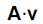
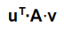

## Introduction

Mathématiques is numerical library for performing linear algebra, calculus, vector calculus, etc in C++ via simple MATLAB-like syntax while also providing run-time performance and memory usage of hand-coded C or Fortran.

_Mathématiques distinguishes itself from other libraries by an elegance and versatility that are only possible using the features of C++11,14, and 17._


## Table of Contents

+ [Features](#features)
  + [Math](#math)
  + [Output, I/O, and debugging](#output)
  + [Documentation features](#documentation-features)
+ [Examples](#examples)
  + [EXAMPLE 1: Element-wise `Vector` math](#example-1)
  + [EXAMPLE 2: Complicated Element-wise `Vector` math](#example-2)
  + [EXAMPLE 3: Linear Algebra](#example-3)
  + [EXAMPLE 4: Complicated Linear Algebra](#example-4)


## Features
+ Simple Matlab-like syntax with no run-time cost
+ Performance comparable to C and Fortran

### Math
+ Mixed-type math with auto-promotion
+ Imaginary type
  + Imaginary<double> + <double> auto-promotes to a std::complex<double>
+ Linear algebra
  + inner products
  + outer products
+ Tensors
+ A multitude of special functions that operate on
  + scalars
  + vectors
  + matrices
+ Calculus
  + derivatives
  + integrals

<a name="#output"></a>
### Output, I/O, and debugging
+ Pretty printing of results
  + styles
  + colors
+ File I/O in various formats including formats for Matlab and Mathematica
+ Debugging modes
  + output includes variable names and formatted vectors / matrices
  + provide bounds checking of arrays and send warnings to the stderr
  + ability to track all large arrays in use

### Documentation features
+ Detailed pretty documentation in Markdown.  
+ Markdown documents can be auto-generated from C++ code.

## Examples

<a name="example-1"></a>
### EXAMPLE 1: Element-wise `Vector` math

**Actual C++ code**
```C++
Vector<double> v1(4);
v1 = {10,20,30,40}; 
Vector<double> v2(4);
v2 = {1,2,3,4}; 

DISP(v1 + v2);
DISP(v1 - v2);
DISP(v1 * v2);
DISP(v1 / v2);
```

**Text Output**
```C++
  v1 + v2 = Vector<double> {11, 22, 33, 44}; 
  v1 - v2 = Vector<double> {9, 18, 27, 36}; 
  v1 * v2 = Vector<double> {10, 40, 90, 160}; 
  v1 / v2 = Vector<double> {10, 10, 10, 10}; 
```

<a name="example-2"></a>
### EXAMPLE 2: Complicated Element-wise `Vector` math

**Actual C++ code**
```C++
Vector<double> u( linspace<double>(-1,1,21) );
Vector<double> v;
v = 10*sin(pi/2*u) + 10;

const double N = double(v.size());
double mu = sum(v)/N;
double sigma = norm(v-mu)/sqrt(N-1);

DISP(mu);
DISP(sigma);
```

**Text Output**
```C++
mu = 10; 
sigma = 7.4162; 
```

<a name="example-3"></a>
### EXAMPLE 3: Linear Algebra



The inner product of linear algebra is designated by the `|` operator, eg ```A | v```.  You can optionally enclose in parentheses so that it looks similar to [Dirac's bra-ket notation](https://en.wikipedia.org/wiki/Bra%E2%80%93ket_notation)): ```(A | v)```.

Note that in bra-ket notation, vectors are neither row nor column vector.  Their behavior is determined by context.   If you would like to create row/column vectors the syntax is: ```Matrix<double> A(N,1)``` for column vectors and ```Matrix<double> A(1,N)``` for row vectors


**Actual C++ code**
```C++
Vector<double> v({2, -1});
Matrix<double> A({{1, 2}, {3, 4}, {5, 6}});
DISP(v);
DISP(A);
DISP(A | v);
```

**Text Output**
```C++
v = {2, -1}; 
A = [
    1, 2
    3, 4
    5, 6
]; 
A|v = {0, 2, 4}; 
```
<a name="example-4"></a>
### EXAMPLE 4: Complicated Linear Algebra



This example is the bilinear form for a matrix ```A``` and two vectors ```u``` and ```v```.  From context, ```u``` behaves as a row vector and ```v``` behaves as acolumn vector.

**Actual C++ code**
```C++
Vector<double> v({2, -1});
Vector<double> u({1, -2, 4});
Matrix<double> A({{1, 2}, {3, 4}, {5, 6}});

DISP(u);
DISP(v);
DISP(A);
DISP(u|A|v);
DISP(u|(2*A-1)|(10 * sin(pi / 2 * v) + 5));
```

**Text Output**
```C++
u = {1, -2, 4}; 
v = {2, -1}; 
A = [
    1, 2
    3, 4
    5, 6
]; 
u|A|v = 12; 
u|(2*A-1)|(10 * sin(pi / 2 * v) + 5) = -30; 
```

