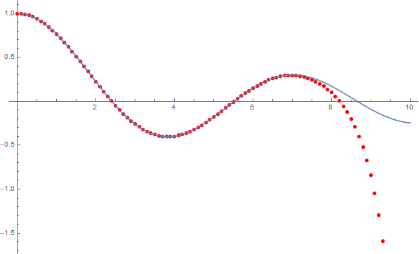
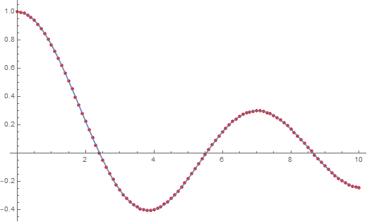
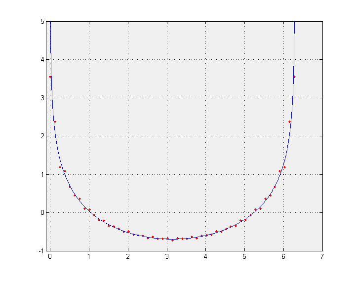

[<h1 style='border: 2px solid; text-align: center'>Mathématiques 0.42.1-alpha.002</h1>](../../../README.md)

<details>

<summary>Documentation</summary>

# [Documentation](../../README.md)<br>
Chapter 1. [License](../../license/README.md)<br>
Chapter 2. [About](../../about/README.md)<br>
Chapter 3. [Why?](../../why/README.md)<br>
Chapter 4. [Objectives](../../objectives/README.md)<br>
Chapter 5. [Versioning](../../versioning/README.md)<br>
Chapter 6. [Status & Release Notes](../../status-release/README.md)<br>
Chapter 7. [Upcoming Development](../../development-schedule/README.md)<br>
Chapter 8. _Introduction with Examples_ <br>
Chapter 9. [Installation](../../installation/README.md)<br>
Chapter 10. [Your First Mathématiques Project](../../first-project/README.md)<br>
Chapter 11. [Usage Guide: Syntax, Data Types, Functions, etc](../../user-guide/README.md)<br>
Chapter 12. [Benchmarks](../../benchmarks/README.md)<br>
Chapter 13. [Tests](../../test/README.md)<br>
Chapter 14. [Developer Guide: Modifying and Extending Mathématiques](../../developer-guide/README.md)<br>


</details>


<details>

<summary>Introduction with Examples</summary>

# [8. Introduction with Examples](../README.md)<br>
8.1. [Pretty Printing and Debugging](../print-debug/README.md)<br>
8.2. [Number Systems and Arithmetic](../numbers/README.md)<br>
8.3. [Vectors, Matrices, and MultiArrays](../multiarrays/README.md)<br>
8.4. [Nested MultiArrays](../nested-multiarrays/README.md)<br>
8.5. [Special Vectors, Matrices, and MultiArrays](../special-multiarrays/README.md)<br>
8.6. [MultiArray Arithmetic](../multiarray-arithmetic/README.md)<br>
8.7. [Linear Algebra](../linear-algebra/README.md)<br>
8.8. [Sorting, Masks, Slices, etc.](../sort-mask-slice/README.md)<br>
8.9. [Common and Special Mathematical Functions](../math-functions/README.md)<br>
8.10. [Mutlivariate Calculus](../multi-var-calculus/README.md)<br>
8.11. [Calculus on Complex Number Domains](../complex-calculus/README.md)<br>
8.12. [Vector Calculus and Curvilinear Coordinates](../vector-calculus/README.md)<br>
8.13. [Tensors](../tensors/README.md)<br>
8.14. _Series and transforms_ <br>


</details>


# 8.14. Series and transforms


## Taylor Series for the Bessel Function J<sub>0</sub>(r)
We can easily calculate a [Taylor Series](http://mathworld.wolfram.com/TaylorSeries.html) in mathq. As an example, let's calculate the Taylor series for the [Bessel Function of the first kind](http://mathworld.wolfram.com/BesselFunctionoftheFirstKind.html) of order 0, J<sub>0</sub>(r). 
The first 20 (n=0,1,...19) coefficients for  J<sub>0</sub>(r), are:

```C++
☀ J0Coeffs ➜ {
     1.00000000 10^+00,  0.00000000 10^+00, -2.50000000 10^-01,  0.00000000 10^+00,  1.56250000 10^-02, 
     0.00000000 10^+00, -4.34028000 10^-04,  0.00000000 10^+00,  6.78168000 10^-06,  0.00000000 10^+00, 
    -6.78168000 10^-08,  0.00000000 10^+00,  4.70950000 10^-10,  0.00000000 10^+00, -2.40281000 10^-12, 
     0.00000000 10^+00,  9.38597000 10^-15,  0.00000000 10^+00, -2.89690000 10^-17,  0.00000000 10^+00
};
```
These were determined using the following `Mathematica` command

```Mathematica
N[Table[SeriesCoefficient[BesselJ[0,r],{r,0,n}],{n,0,19}]]

```


Set up the output format so that we can copy and paste into Mathematica
```C++
using namespace display;
FormatDataVector::string_opening = "{\n    ";
FormatDataVector::string_delimeter = ", ";
FormatDataVector::max_elements_per_line = 5;
FormatDataVector::string_endofline = "\n    ";
FormatDataVector::string_closing = "\n}";
setFormatString<double>(" 6.95313604e-310");
FormatData<double>::tens = true;
```

Define the Vector of coefficients: 

```C++
Vector<double> J0Coeffs = Vector<double>({ 1.,0.,-0.25,0.,0.015625,0.,-0.000434028,0.,6.78168e-6,0.,-6.78168e-8,0.,4.7095e-10,0.,-2.40281e-12,0.,9.38597e-15,0.,-2.8969e-17,0. });
```

Define the coordinate vector `r` as 101 points over the interval [0,10]: 

```C++
Vector<double> r = linspace<double>(0, 10, 101);
```

Calculate the Taylor series and store the results in vector `y`: 

```C++
Vector<double> y = taylor(J0Coeffs, r, 19);
```

The results `r` and `y` are:

```Mathematica
☀ r ➜ {
     0.00000000 10^+00,  1.00000000 10^-01,  2.00000000 10^-01,  3.00000000 10^-01,  4.00000000 10^-01, 
     5.00000000 10^-01,  6.00000000 10^-01,  7.00000000 10^-01,  8.00000000 10^-01,  9.00000000 10^-01, 
     1.00000000 10^+00,  1.10000000 10^+00,  1.20000000 10^+00,  1.30000000 10^+00,  1.40000000 10^+00, 
     1.50000000 10^+00,  1.60000000 10^+00,  1.70000000 10^+00,  1.80000000 10^+00,  1.90000000 10^+00, 
     2.00000000 10^+00,  2.10000000 10^+00,  2.20000000 10^+00,  2.30000000 10^+00,  2.40000000 10^+00, 
     2.50000000 10^+00,  2.60000000 10^+00,  2.70000000 10^+00,  2.80000000 10^+00,  2.90000000 10^+00, 
     3.00000000 10^+00,  3.10000000 10^+00,  3.20000000 10^+00,  3.30000000 10^+00,  3.40000000 10^+00, 
     3.50000000 10^+00,  3.60000000 10^+00,  3.70000000 10^+00,  3.80000000 10^+00,  3.90000000 10^+00, 
     4.00000000 10^+00,  4.10000000 10^+00,  4.20000000 10^+00,  4.30000000 10^+00,  4.40000000 10^+00, 
     4.50000000 10^+00,  4.60000000 10^+00,  4.70000000 10^+00,  4.80000000 10^+00,  4.90000000 10^+00, 
     5.00000000 10^+00,  5.10000000 10^+00,  5.20000000 10^+00,  5.30000000 10^+00,  5.40000000 10^+00, 
     5.50000000 10^+00,  5.60000000 10^+00,  5.70000000 10^+00,  5.80000000 10^+00,  5.90000000 10^+00, 
     6.00000000 10^+00,  6.10000000 10^+00,  6.20000000 10^+00,  6.30000000 10^+00,  6.40000000 10^+00, 
     6.50000000 10^+00,  6.60000000 10^+00,  6.70000000 10^+00,  6.80000000 10^+00,  6.90000000 10^+00, 
     7.00000000 10^+00,  7.10000000 10^+00,  7.20000000 10^+00,  7.30000000 10^+00,  7.40000000 10^+00, 
     7.50000000 10^+00,  7.60000000 10^+00,  7.70000000 10^+00,  7.80000000 10^+00,  7.90000000 10^+00, 
     8.00000000 10^+00,  8.10000000 10^+00,  8.20000000 10^+00,  8.30000000 10^+00,  8.40000000 10^+00, 
     8.50000000 10^+00,  8.60000000 10^+00,  8.70000000 10^+00,  8.80000000 10^+00,  8.90000000 10^+00, 
     9.00000000 10^+00,  9.10000000 10^+00,  9.20000000 10^+00,  9.30000000 10^+00,  9.40000000 10^+00, 
     9.50000000 10^+00,  9.60000000 10^+00,  9.70000000 10^+00,  9.80000000 10^+00,  9.90000000 10^+00, 
     1.00000000 10^+01
};
☀ y ➜ {
     1.00000000 10^+00,  9.97501562 10^-01,  9.90024972 10^-01,  9.77626247 10^-01,  9.60398227 10^-01, 
     9.38469807 10^-01,  9.12004863 10^-01,  8.81200889 10^-01,  8.46287353 10^-01,  8.07523798 10^-01, 
     7.65197686 10^-01,  7.19622018 10^-01,  6.71132744 10^-01,  6.20085988 10^-01,  5.66855119 10^-01, 
     5.11827669 10^-01,  4.55402164 10^-01,  3.97984854 10^-01,  3.39986403 10^-01,  2.81818548 10^-01, 
     2.23890764 10^-01,  1.66606960 10^-01,  1.10362240 10^-01,  5.55397486 10^-02,  2.50763664 10^-03, 
    -4.83838365 10^-02, -9.68050309 10^-02, -1.42449467 10^-01, -1.85036155 10^-01, -2.24311697 10^-01, 
    -2.60052141 10^-01, -2.92064577 10^-01, -3.20188449 10^-01, -3.44296600 10^-01, -3.64296007 10^-01, 
    -3.80128234 10^-01, -3.91769577 10^-01, -3.99230914 10^-01, -4.02557260 10^-01, -4.01827030 10^-01, 
    -3.97151024 10^-01, -3.88671136 10^-01, -3.76558809 10^-01, -3.61013244 10^-01, -3.42259391 10^-01, 
    -3.20545723 10^-01, -2.96141837 10^-01, -2.69335886 10^-01, -2.40431882 10^-01, -2.09746876 10^-01, 
    -1.77608071 10^-01, -1.44349862 10^-01, -1.10310865 10^-01, -7.58309355 10^-02, -4.12482347 10^-02, 
    -6.89634842 10^-03,  2.68984896 10^-02,  5.98200470 10^-02,  9.15645787 10^-02,  1.21843114 10^-01, 
     1.50383509 10^-01,  1.76932226 10^-01,  2.01255800 10^-01,  2.23141939 10^-01,  2.42400227 10^-01, 
     2.58862350 10^-01,  2.72381800 10^-01,  2.82832983 10^-01,  2.90109632 10^-01,  2.94122444 10^-01, 
     2.94795809 10^-01,  2.92063507 10^-01,  2.85863190 10^-01,  2.76129464 10^-01,  2.62785336 10^-01, 
     2.45731731 10^-01,  2.24834767 10^-01,  1.99910364 10^-01,  1.70705741 10^-01,  1.36877214 10^-01, 
     9.79636492 10^-02,  5.33547878 10^-02,  2.25350703 10^-03, -5.63690505 10^-02, -1.23826757 10^-01, 
    -2.01781672 10^-01, -2.92318840 10^-01, -3.98034732 10^-01, -5.22141673 10^-01, -6.68590971 10^-01, 
    -8.42217903 10^-01, -1.04891218 10^+00, -1.29581806 10^+00, -1.59156901 10^+00, -1.94656229 10^+00, 
    -2.37327999 10^+00, -2.88666362 10^+00, -3.50455066 10^+00, -4.24818247 10^+00, -5.14279434 10^+00, 
    -6.21830000 10^+00
};
```
Cut and paste the above data for r and y into Mathematica as well as the following commands

```Mathematica
p1=ListPlot[Partition[Riffle[r,y],2],PlotStyle->Red];
p2=Plot[BesselJ[0,r],{r,0,10}];
Show[p1,p2]
```
This yields the following plot comparing the Taylor series [red dots] to the exact function [solid blue].

## Maclaurin Series for the Bessel Function J<sub>0</sub>(x)
To acheive better accuracy, we can calculate the [Maclaurin Series](http://mathworld.wolfram.com/MaclaurinSeries.html) at the point `r=5`, which is the center of our interval of interest.
The first 20 (n=0,1,...19) coefficients for the Maclaurin Series (r<sub>0</sub>=5) for the function J<sub>0</sub>(r), are:

```C++
☀ J0Coeffs ➜ {
    -1.77597000 10^-01,  3.27579000 10^-01,  5.60405000 10^-02, -5.61487000 10^-02, -1.70739000 10^-03, 
     2.52021000 10^-03,  1.12022000 10^-05, -5.37950000 10^-05,  2.13330000 10^-07,  6.78110000 10^-07, 
    -4.88572000 10^-09, -5.66420000 10^-09,  4.80096000 10^-11,  3.37094000 10^-11, -2.99711000 10^-13, 
    -1.50298000 10^-13,  1.33856000 10^-15,  5.20979000 10^-16, -4.54744000 10^-18, -1.44449000 10^-18
};
```
These were determined using the following `Mathematica` command

```Mathematica
N[Table[SeriesCoefficient[BesselJ[0,r],{r,5,n}],{n,0,19}]]

```


Set up the output format so that we can copy and paste into Mathematica, this time using the function `set_mathematica_var_format`
```C++
set_mathematica_var_format();
```

Define the Vector of coefficients: 

```C++
Vector<double> J0Coeffs = Vector<double>({ -0.177597,0.327579,0.0560405,-0.0561487,-0.00170739,0.00252021,0.0000112022,-0.000053795,2.1333e-7,6.7811e-7,-4.88572e-9,-5.6642e-9,4.80096e-11,3.37094e-11,-2.99711e-13,-1.50298e-13,1.33856e-15,5.20979e-16,-4.547;
```

Define the coordinate vector `r` as 101 points over the interval [0,10]: 

```C++
Vector<double> r = linspace<double>(0, 10, 101);
```

Calculate the Maclaurin series and store the results in vector `y`: 

```C++
Vector<double> y = maclaurin(J0Coeffs, r, 19, 5.);
```

The results `r` and `y` are:

```Mathematica
☀ r ➜ {
     0.00000000 10^+00,  1.00000000 10^-01,  2.00000000 10^-01,  3.00000000 10^-01,  4.00000000 10^-01, 
     5.00000000 10^-01,  6.00000000 10^-01,  7.00000000 10^-01,  8.00000000 10^-01,  9.00000000 10^-01, 
     1.00000000 10^+00,  1.10000000 10^+00,  1.20000000 10^+00,  1.30000000 10^+00,  1.40000000 10^+00, 
     1.50000000 10^+00,  1.60000000 10^+00,  1.70000000 10^+00,  1.80000000 10^+00,  1.90000000 10^+00, 
     2.00000000 10^+00,  2.10000000 10^+00,  2.20000000 10^+00,  2.30000000 10^+00,  2.40000000 10^+00, 
     2.50000000 10^+00,  2.60000000 10^+00,  2.70000000 10^+00,  2.80000000 10^+00,  2.90000000 10^+00, 
     3.00000000 10^+00,  3.10000000 10^+00,  3.20000000 10^+00,  3.30000000 10^+00,  3.40000000 10^+00, 
     3.50000000 10^+00,  3.60000000 10^+00,  3.70000000 10^+00,  3.80000000 10^+00,  3.90000000 10^+00, 
     4.00000000 10^+00,  4.10000000 10^+00,  4.20000000 10^+00,  4.30000000 10^+00,  4.40000000 10^+00, 
     4.50000000 10^+00,  4.60000000 10^+00,  4.70000000 10^+00,  4.80000000 10^+00,  4.90000000 10^+00, 
     5.00000000 10^+00,  5.10000000 10^+00,  5.20000000 10^+00,  5.30000000 10^+00,  5.40000000 10^+00, 
     5.50000000 10^+00,  5.60000000 10^+00,  5.70000000 10^+00,  5.80000000 10^+00,  5.90000000 10^+00, 
     6.00000000 10^+00,  6.10000000 10^+00,  6.20000000 10^+00,  6.30000000 10^+00,  6.40000000 10^+00, 
     6.50000000 10^+00,  6.60000000 10^+00,  6.70000000 10^+00,  6.80000000 10^+00,  6.90000000 10^+00, 
     7.00000000 10^+00,  7.10000000 10^+00,  7.20000000 10^+00,  7.30000000 10^+00,  7.40000000 10^+00, 
     7.50000000 10^+00,  7.60000000 10^+00,  7.70000000 10^+00,  7.80000000 10^+00,  7.90000000 10^+00, 
     8.00000000 10^+00,  8.10000000 10^+00,  8.20000000 10^+00,  8.30000000 10^+00,  8.40000000 10^+00, 
     8.50000000 10^+00,  8.60000000 10^+00,  8.70000000 10^+00,  8.80000000 10^+00,  8.90000000 10^+00, 
     9.00000000 10^+00,  9.10000000 10^+00,  9.20000000 10^+00,  9.30000000 10^+00,  9.40000000 10^+00, 
     9.50000000 10^+00,  9.60000000 10^+00,  9.70000000 10^+00,  9.80000000 10^+00,  9.90000000 10^+00, 
     1.00000000 10^+01
};
☀ y ➜ {
     1.00000668 10^+00,  9.97507551 10^-01,  9.90030364 10^-01,  9.77631117 10^-01,  9.60402637 10^-01, 
     9.38473806 10^-01,  9.12008493 10^-01,  8.81204183 10^-01,  8.46290342 10^-01,  8.07526510 10^-01, 
     7.65200146 10^-01,  7.19624246 10^-01,  6.71134761 10^-01,  6.20087814 10^-01,  5.66856768 10^-01, 
     5.11829159 10^-01,  4.55403508 10^-01,  3.97986066 10^-01,  3.39987496 10^-01,  2.81819533 10^-01, 
     2.23891651 10^-01,  1.66607760 10^-01,  1.10362962 10^-01,  5.55404022 10^-02,  2.50823073 10^-03, 
    -4.83832933 10^-02, -9.68045300 10^-02, -1.42449000 10^-01, -1.85035712 10^-01, -2.24311270 10^-01, 
    -2.60051721 10^-01, -2.92064153 10^-01, -3.20188011 10^-01, -3.44296135 10^-01, -3.64295502 10^-01, 
    -3.80127675 10^-01, -3.91768946 10^-01, -3.99230191 10^-01, -4.02556422 10^-01, -4.01826050 10^-01, 
    -3.97149867 10^-01, -3.88669758 10^-01, -3.76557152 10^-01, -3.61011234 10^-01, -3.42256925 10^-01, 
    -3.20542661 10^-01, -2.96137985 10^-01, -2.69330974 10^-01, -2.40425527 10^-01, -2.09738542 10^-01, 
    -1.77597000 10^-01, -1.44334989 10^-01, -1.10290695 10^-01, -7.58033792 10^-02, -4.12103810 10^-02, 
    -6.84416090 10^-03,  2.69705817 10^-02,  5.99196953 10^-02,  9.17022418 10^-02,  1.22033017 10^-01, 
     1.50644908 10^-01,  1.77291061 10^-01,  2.01746848 10^-01,  2.23811618 10^-01,  2.43310201 10^-01, 
     2.60094185 10^-01,  2.74042921 10^-01,  2.85064276 10^-01,  2.93095117 10^-01,  2.98101522 10^-01, 
     3.00078725 10^-01,  2.99050799 10^-01,  2.95070069 10^-01,  2.88216278 10^-01,  2.78595509 10^-01, 
     2.66338874 10^-01,  2.51600980 10^-01,  2.34558207 10^-01,  2.15406786 10^-01,  1.94360723 10^-01, 
     1.71649572 10^-01,  1.47516093 10^-01,  1.22213799 10^-01,  9.60044392 10^-02,  6.91554233 10^-02, 
     4.19372169 10^-02,  1.46207378 10^-02, -1.25252286 10^-02, -3.92365687 10^-02, -6.52563117 10^-02, 
    -9.03370090 10^-02, -1.14243002 10^-01, -1.36752557 10^-01, -1.57659847 10^-01, -1.76776766 10^-01, 
    -1.93934560 10^-01, -2.08985255 10^-01, -2.21802884 10^-01, -2.32284482 10^-01, -2.40350867 10^-01, 
    -2.45947183 10^-01
};
```
Cut and paste the above data for r and y into Mathematica as well as the following commands

```Mathematica
p1=ListPlot[Partition[Riffle[r,y],2],PlotStyle->Red];
p2=Plot[BesselJ[0,r],{r,0,10}];
Show[p1,p2]
```
This yields the following plot comparing the Maclaurin series [red dots] to the exact function [solid blue].

Calculating a function via Fourier series and plotting the results in Matlab
## Fourier Series for the Clausen Functions
As our example, we'll use the [Clausen functions](http://mathworld.wolfram.com/ClausenFunction.html). The Clausen function of order _n_ has Fourier series: 

### Clausen function of order _n=1_


Set up the output format so that we can copy and paste into Matlab
```C++
using namespace display;
FormatDataVector::string_opening = "[ ...\n    ";
FormatDataVector::string_delimeter = ", ";
FormatDataVector::max_elements_per_line = 5;
FormatDataVector::string_endofline = " ...\n    ";
FormatDataVector::string_closing = " ...\n]";
setFormatString<double>(" 6.95313604e-310");
FormatData<double>::tens = false;
```

Define the coefficient vectors: 

```C++
const size_t N = 20;
Vector<double> k = range<double>(0, N-1);
Vector<double> An = 1/k;
An[0] = 0.;
Vector<double> Bn = Vector<double>(N, 0.);
```

Define the coordinate vector `t` as 51 points over the interval [0,+2pi]: 

```C++
const double pi = 3.14159265358979323846;
Vector<double> t = linspace<double>(0, 2*pi, 51);
```

Calculate the Fourier series and store the results in vector `CL1`: 

```C++
const double T = 2*pi;
const double omega = 2*pi/T;
Vector<double> CL1 = ifourier(An, Bn, t, An.size(), omega);
```

The results `t` and `CL1` are:

```Matlab
☀ t ➜ [ ...
     0.00000000e+00,  1.25663706e-01,  2.51327412e-01,  3.76991118e-01,  5.02654825e-01,  ...
     6.28318531e-01,  7.53982237e-01,  8.79645943e-01,  1.00530965e+00,  1.13097336e+00,  ...
     1.25663706e+00,  1.38230077e+00,  1.50796447e+00,  1.63362818e+00,  1.75929189e+00,  ...
     1.88495559e+00,  2.01061930e+00,  2.13628300e+00,  2.26194671e+00,  2.38761042e+00,  ...
     2.51327412e+00,  2.63893783e+00,  2.76460154e+00,  2.89026524e+00,  3.01592895e+00,  ...
     3.14159265e+00,  3.26725636e+00,  3.39292007e+00,  3.51858377e+00,  3.64424748e+00,  ...
     3.76991118e+00,  3.89557489e+00,  4.02123860e+00,  4.14690230e+00,  4.27256601e+00,  ...
     4.39822972e+00,  4.52389342e+00,  4.64955713e+00,  4.77522083e+00,  4.90088454e+00,  ...
     5.02654825e+00,  5.15221195e+00,  5.27787566e+00,  5.40353936e+00,  5.52920307e+00,  ...
     5.65486678e+00,  5.78053048e+00,  5.90619419e+00,  6.03185789e+00,  6.15752160e+00,  ...
     6.28318531e+00 ...
];
☀ CL1 ➜ [ ...
     3.54773966e+00,  2.37649806e+00,  1.18837837e+00,  1.08954466e+00,  6.70212104e-01,  ...
     4.49882732e-01,  3.66844724e-01,  1.01722992e-01,  7.16511105e-02, -7.02907275e-02,  ...
    -1.88547918e-01, -2.03656272e-01, -3.47537369e-01, -3.62834235e-01, -4.23505952e-01,  ...
    -5.07163697e-01, -4.93690818e-01, -5.82134430e-01, -5.89925205e-01, -6.05336519e-01,  ...
    -6.68655244e-01, -6.36694714e-01, -6.87730744e-01, -6.90152151e-01, -6.71362890e-01,  ...
    -7.18771403e-01, -6.71362890e-01, -6.90152151e-01, -6.87730744e-01, -6.36694714e-01,  ...
    -6.68655244e-01, -6.05336519e-01, -5.89925205e-01, -5.82134430e-01, -4.93690818e-01,  ...
    -5.07163697e-01, -4.23505952e-01, -3.62834235e-01, -3.47537369e-01, -2.03656272e-01,  ...
    -1.88547918e-01, -7.02907275e-02,  7.16511105e-02,  1.01722992e-01,  3.66844724e-01,  ...
     4.49882732e-01,  6.70212104e-01,  1.08954466e+00,  1.18837837e+00,  2.37649806e+00,  ...
     3.54773966e+00 ...
];
```
Cut and paste the above data for `t` and `CL1` into Matlab as well as the following commands

```Matlab
N=10000;
dt=2*pi/N;
tt=linspace(dt,2*pi-dt,10000);
y1=-log(2*abs(sin(tt/2)));
plot(t,CL1,'r.',tt,y1)
```
The above matlab code calculates the first Clausen function using the equation


We exclude the end points, 0 and pi, because the function is infinite at these points.
This yields the following plot comparing the Fourier series [red dots] to the exact function [solid blue].

### Clausen function of order _n=2_


Set up the output format so that we can copy and paste into Matlab, this time using the function `set_matlab_var_format()`
```C++
set_matlab_var_format();
```

Define the coefficient vectors: 

```C++
const size_t N = 20;
Vector<double> k = range<double>(0, N-1);
Vector<double> An = Vector<double>(N, 0.);
Vector<double> Bn = 1./sqr(k);
Bn[0] = 0.;
```

Define the coordinate vector `t` as 51 points over the interval [0,+2pi]: 

```C++
const double pi = 3.14159265358979323846;
Vector<double> t = linspace<double>(0, 2*pi, 51);
```

Calculate the Fourier series and store the results in vector `CL2`: 

```C++
const double T = 2*pi;
const double omega = 2*pi/T;
Vector<double> CL2 = ifourier(An, Bn, t, An.size(), omega);
```

The results `t` and `CL2` are:

```Matlab
☀ t ➜ [ ...
     0.00000000e+00,  1.25663706e-01,  2.51327412e-01,  3.76991118e-01,  5.02654825e-01,  ...
     6.28318531e-01,  7.53982237e-01,  8.79645943e-01,  1.00530965e+00,  1.13097336e+00,  ...
     1.25663706e+00,  1.38230077e+00,  1.50796447e+00,  1.63362818e+00,  1.75929189e+00,  ...
     1.88495559e+00,  2.01061930e+00,  2.13628300e+00,  2.26194671e+00,  2.38761042e+00,  ...
     2.51327412e+00,  2.63893783e+00,  2.76460154e+00,  2.89026524e+00,  3.01592895e+00,  ...
     3.14159265e+00,  3.26725636e+00,  3.39292007e+00,  3.51858377e+00,  3.64424748e+00,  ...
     3.76991118e+00,  3.89557489e+00,  4.02123860e+00,  4.14690230e+00,  4.27256601e+00,  ...
     4.39822972e+00,  4.52389342e+00,  4.64955713e+00,  4.77522083e+00,  4.90088454e+00,  ...
     5.02654825e+00,  5.15221195e+00,  5.27787566e+00,  5.40353936e+00,  5.52920307e+00,  ...
     5.65486678e+00,  5.78053048e+00,  5.90619419e+00,  6.03185789e+00,  6.15752160e+00,  ...
     6.28318531e+00 ...
];
☀ CL2 ➜ [ ...
     0.00000000e+00,  3.91566598e-01,  6.00043244e-01,  7.41013319e-01,  8.55181325e-01,  ...
     9.20043638e-01,  9.74362042e-01,  1.00263931e+00,  1.01203918e+00,  1.01443074e+00,  ...
     9.95652326e-01,  9.72211411e-01,  9.37639689e-01,  8.91563220e-01,  8.43916566e-01,  ...
     7.83912730e-01,  7.21452670e-01,  6.54423794e-01,  5.79351826e-01,  5.05675854e-01,  ...
     4.24673341e-01,  3.42573051e-01,  2.60246747e-01,  1.72246706e-01,  8.78556347e-02,  ...
    -2.15360760e-16, -8.78556347e-02, -1.72246706e-01, -2.60246747e-01, -3.42573051e-01,  ...
    -4.24673341e-01, -5.05675854e-01, -5.79351826e-01, -6.54423794e-01, -7.21452670e-01,  ...
    -7.83912730e-01, -8.43916566e-01, -8.91563220e-01, -9.37639689e-01, -9.72211411e-01,  ...
    -9.95652326e-01, -1.01443074e+00, -1.01203918e+00, -1.00263931e+00, -9.74362042e-01,  ...
    -9.20043638e-01, -8.55181325e-01, -7.41013319e-01, -6.00043244e-01, -3.91566598e-01,  ...
    -9.12300242e-16 ...
];
```
Cut and paste the above data for t and CL2 into Matlab as well as the following commands.

```Matlab
N=10000;
dt=2*pi/N;
tt=linspace(dt,2*pi-dt,10000);
y2=cumtrapz(-log(2*abs(sin(tt/2))))*dt;
plot(t,CL2,'r.',tt,y2)
```
The above matlab code calculates the second Clausen function using the following integral


We exclude the end points, 0 and pi, because the integrand is infinite at these points.
This yields the following plot comparing the Fourier series [red dots] to the exact function [solid blue].


| ⇦ <br />[Tensors](../tensors/README.md)  | [Introduction with Examples](../README.md)<br />Series and transforms<br /> | ⇨ <br />   |
| ------------ | :-------------------------------: | ------------ |

