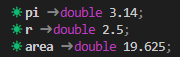

<h1 style='border: 2px solid; text-align: center'>Mathématiques v3.5.78-c++17</h1>

<details>

<summary>User Manual</summary>

# [User Manual](../../README.md)<br>
1. [About](../../about/README.md)<br>
2. [License](../../license/README.md)<br>
3. [Status, Planned Work & Release Notes](../../status-release/README.md)<br>
4. [Description and Example Usage](../../description-examples/README.md)<br>
5. [Installation](../../installation/README.md)<br>
6. [Your First Mathématiques Project](../../first-project/README.md)<br>
7. _Usage Guide: Syntax, Data Types, Functions, etc_ <br>
8. [Benchmarks](../../benchmarks/README.md)<br>
9. [Tests](../../test/README.md)<br>
10. [Developer Guide: Modifying and Extending Mathématiques](../../developer-guide/README.md)<br>


</details>


<details>

<summary>Usage Guide: Syntax, Data Types, Functions, etc</summary>

# [7. Usage Guide: Syntax, Data Types, Functions, etc](../README.md)<br>

7.1. _Usage Guide Notation_ <br>
7.2. [Scalar Types (Real, Imaginary, Complex & Quaternion)](../scalars/README.md)<br>
7.3. [Container Types (Vector, Matrix & Tensor)](../containers/README.md)<br>
7.4. [Operators](../operators/README.md)<br>
7.5. [Functions](../functions/README.md)<br>
7.6. [Linear Algebra](../linear-algebra/README.md)<br>
7.7. [Indexing, Masks, and Sorting](../indexing-sorting/README.md)<br>
7.8. [Ranges and Grids](../ranges-grids/README.md)<br>
7.9. [Calculus](../calculus/README.md)<br>
7.10. [Vector Calculus](../vector-calculus/README.md)<br>
7.11. [Tensor Calculus](../tensor-calculus/README.md)<br>
7.12. [Display of Results](../display/README.md)<br>
7.13. [FILE I/O](../file-io/README.md)<br>
7.14. [Debug Modes](../debug/README.md)<br>


</details>


# 7.1. Usage Guide Notation

_This document was generated from the C++ file_ `notation/body.cpp` _using macros and functions (in namespace `mathq::display`) from the header_ `"mathq.h"`. 
<br>

## Code and results
In this documentation, code is shown inline as `int x` and in code blocks:


```C++
double pi = 3.14;
double r = 2.5;
double area = pi * pow(r, 2);
```
Results are also shown in code blocks but with each line preceded by the symbol `☀ `


```C++
☀ pi ➜ double 3.14;
☀ r ➜ double 2.5;
☀ area ➜ double 19.625;
```
This is also how the results are output in a linux terminal, albeit with slightly different coloring.  A screen shot of the same results are shown below




The code used to display these results is:


```C++
TRDISP(pi);
TRDISP(r);
TRDISP(area);
```
This topic is covered in detail in the Display section of this guide.

Often we will display code and results together, with the symbol `☀ ` distinguishing results from code:

```C++
double x = 1.52;
☀ x ➜ double 1.52;
```
## Numbers and containers
The following notation shorthand is used in the User Guide (but certainly not in C++ code!).

### Scalars

| symbol | C++ types |
| :---: | :---: | 
| ℤ | any C++ real signed integral type: `bool`, `int`, `long`, etc | 
| ℕ | any C++ real unsigned integral type: `unsigned int`, `unsigned long`, etc | 
| ℝ | any C++ real floating-point type: `float`, `double`, `long double`) | 
| ℂ | any `std::complex<ℝ>` | 
| 𝕁 | any `Imaginary<ℝ>` | 
| ℍ | any `Quaternion<ℝ>` | 
| 𝕂 | any ℝ, ℂ, 𝕁, ℍ | 
| 𝕤 | any ℤ, 𝕂 | 

Lower case 𝕤 was chosen because 𝕊 is commonly used in mathematics for the spherical groups


<br>

### Containers

| symbol | C++ types |
| :---: | :---: | 
| 𝕍 | any `Vector<T>` for any scalar or container type or type symbol T | 
| 𝕄 | any `Matrix<T>` for any scalar or container type or type symbol T | 
| 𝕥 | any `Tensor<T>` for any scalar or container type or type symbol T | 
| 𝕌 | any 𝕍, 𝕄, 𝕥 | 

Lower case 𝕥 was chosen because 𝕋 is commonly used in mathematics for the torus groups


<br>


| ⇦ <br />  | [Usage Guide: Syntax, Data Types, Functions, etc](../README.md)<br />Usage Guide Notation<br /> | ⇨ <br />[Scalar Types (Real, Imaginary, Complex & Quaternion)](../scalars/README.md)   |
| ------------ | :-------------------------------: | ------------ |

